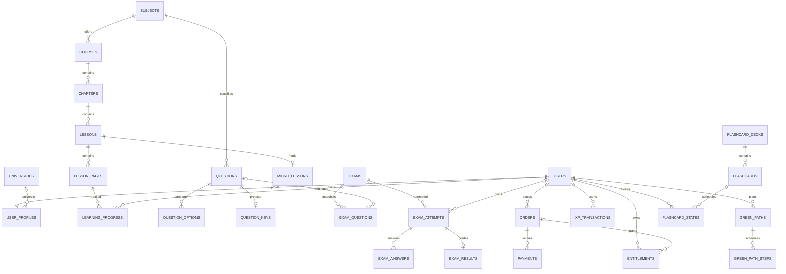

# Backend Blueprint تپش — نسخهٔ تصمیم‌گیری پیش از پیاده‌سازی

**تاریخ بررسی:** ۱۴۰۵/۰۷/۱۰ (۲۰۲۶-۱۰-۰۲) · **مبنای کد:** `main`، `c2f2a54`، درخت کاری تمیز در آغاز · **وضعیت:** Blueprint پیشنهادی، **نه** بک‌اند Laravel اجراشده. علامت‌ها: **موجود** = در کد/دادهٔ کنونی؛ **طرح** = تصمیم پیشنهادی برای فاز بعد؛ **مشروط** = وابسته به تصمیم محصول یا محیط. هیچ دادهٔ موجود، کد برنامه، API، migration اجرایی یا UI در این مرحله تغییر نکرده است.

## ۱. حکم معماری و مرز مرحلهٔ اول

تپش هم‌اکنون «فرانت‌اند بدون بک‌اند» نیست: React/Vite با روتر hash، یک سرور HTTP خودنویس Node، فروشگاه JSON با کنترل یکپارچگی، احراز هویت و RBAC، پنل محتوایی و موتور آزمون هماهنگ **موجود** است. در مقابل، پرداخت، اشتراک معتبر، دیتابیس رابطه‌ای و بسیاری از امکانات دانشجو فقط mock/localStorage هستند. هدف، مهاجرت **تدریجیِ قراردادمحور** به modular monolith با Laravel + PostgreSQL است؛ نه ساخت ماژول‌های خالی یا جایگزینی یک‌بارهٔ ۲۳۰ عملیات HTTP موجود.

| تصمیم | دلیل و بده‌بستان |
|---|---|
| Laravel/PHP + PostgreSQL برای هستهٔ نهایی؛ Node فعلی تا اثبات هم‌ارزی فعال بماند | تراکنش/FK/index، queue و policy استاندارد در برابر هزینهٔ بازنویسی و ریسک ناهم‌خوانی DTO و نشست. گزینهٔ کم‌هزینه‌تر: ارتقای فروشگاه Node به PostgreSQL؛ اگر برابری قرارداد Laravel یا محیط PHP فراهم نشد، همین گزینه از بازنویسی اجباری بهتر است. |
| اپلیکیشن جدید در مرز مستقلِ آینده (`backend/`، **هنوز ساخته نشده**) با ماژول‌های دامنه‌ای در همان process | یک deploy و یک DB، مالکیت روشن داده؛ repository فقط برای gateway پرداخت/فایل/جست‌وجو یا مهاجرت store واقعاً متغیر. |
| `/api/v1/*` برای قرارداد جدید؛ `/api/*` قدیم تا زمان cutover دست‌نخورده | تغییر پوشش `{error:"CODE"}` کاربران به `{success:false,error:{...}}` breaking است. adapter فقط در مرز legacy و با تست برابری، نه در business logic. OpenAPI فعلی `docs/api/openapi.json` موجود است؛ نسخهٔ جدید باید جدا تولید شود. |
| منبع حقیقت پروفایل/نتیجه/دسترسی/قیمت سرور؛ وضعیت ناوبری و تم در کلاینت | وضعیت مهمان یا cache نمایش ≠ هویت یا حق دسترسی. قیمت‌های `pricingService.js` نمونه و `amountsConfirmed:false` است؛ پرداخت واقعی قبل از تأیید قیمت خاموش می‌ماند. |
| PostgreSQL system of record؛ Redis فقط cache/queue/rate limit/session؛ فایل بزرگ در object storage | Redis یا localStorage منبع رکورد و حسابرسی نیست؛ در نبود object storage، disk محلی فقط در توسعه، بدون ادعای آمادگی تولید. |

**دروازهٔ معماری → اجرا:** تا وقتی ماتریس این سند، تطبیق ۲۳۰ عملیات واقعی/۱۱ DTO و plan حفظ داده پذیرفته نشده، migration یا Foundation تولیدی آغاز نشود. این سند طرح SQL/Laravel و قراردادهاست؛ «migrationهای واقعی و قابل‌اجرا» خروجی فاز Foundation، **نه** ادعای این فاز. در محیط فعلی `php`، `composer` و `docker` در PATH یافت نشدند؛ اجرای Laravel/PostgreSQL در این نوبت تأییدپذیر نیست. نصب هیچ وابستگی انجام نشده است.

### منابع مستقیم و مرجع حقیقت

- مسیرها: `src/router/appRoute.js:10-68`، `src/layout/dashboard/dashboardRoute.jsx:27-57`، `src/layout/dashboard/DashboardLayout.jsx:227-354`، `src/layout/admin/AdminLayout.jsx:51-151`.
- سرویس‌های کلاینت: `src/services/admin/adminService.js:16-76`، `src/services/greenPath/greenPathRepository.js:1-75`، `src/services/flashcards/flashcardService.js:1-88`، `src/services/testBank/testBankService.js:1-180`، `src/services/international/internationalService.js:1-93`، `src/services/pricing/pricingService.js:1-49`، `src/services/ai/aiService.js:1-36`.
- سرور/داده: `server.js:205-341`، `database/{adminApi,examApi,usersApi,googleAuth,contentStore,examStore}.js`، `database/models/{index,relations,enums}.js`، `database/apiContract/{routeContracts,dtos,errorModel}.js`.
- موجودی‌های پیشین **تاریخی، نه اندازه‌گیری جدید**: `docs/api/client-service-compatibility.md`، `docs/data/phase-19-data-inventory-and-ownership.md`، `docs/api/openapi.json`، `docs/ops/deployment-and-recovery.md`، `docs/audit/PRODUCTION-READINESS-2026-10-02.md`. در OpenAPI فعلی، ۲۳۰ عملیات HTTP زیر ۱۶۶ path ثبت شده است (با شمارش مستقیم فایل). گزارش قدیمی‌ترِ کلاینت ۲۲۹ عملیات و ۱۲۲ مسیر صرفاً توصیف‌شدهٔ کلاینت ثبت می‌کند؛ عدد ۱۲۲ مربوط به آن snapshot است و تا بازاجرای ممیزی، عدد فعلی قطعی نیست. اسکن ایستای «۱۵ مسیر دارای فراخوانی شبکه» مسیرهای dynamic در `adminService`/`coordinatedExamService`/`userStorage` را **نمی‌شمارد**. این اعداد را شمار «کل API مصرفی» تعبیر نکنید.

## ۲. مهندسی معکوس Frontend: فهرست صفحه، state و نیاز داده

در جدول: `A` عمومی؛ `U` کاربر واردشده؛ `D` مدیر با permission مربوط؛ `P` entitlement معتبر؛ `L` محلی/mock فعلی؛ `S` سرور فعلی. ستون APIها **هدف v1** هستند مگر با برچسب «قدیم». `c` کش عمومی کوتاه، `p` صفحه‌بندی، `f` فیلتر/جست‌وجو، `r` به‌روزرسانی زمان‌واقعی (فقط اگر نیاز واقعی باشد). نبود `r` یعنی polling/SSE اجباری نیست.

| صفحه/مسیر واقعی و حالت‌های مهم | داده/جدول هدف؛ منبع اکنون | API و مجوز هدف؛ خصوصیات |
|---|---|---|
| خانه `#`، محصولات `#products`، درباره `#about`، تعرفه `#pricing/#pr-*` | `site_pages,banners,products,plans`؛ فعلاً `siteData.js`/`productsService.js`/`pricingService.js` و بنر/صفحهٔ عمومی S | `GET /site/pages/{slug}`, `/banners`, `/pricing/plans` A؛ c؛ مبلغ خرید فقط پس از تأیید محصول. |
| مقالات `#articles[/slug|/saved|/category/*]`؛ دسته، ذخیره، حالت خالی | `articles,article_categories,article_bookmarks`؛ مقاله S+fallback، ذخیره L | `GET /articles`, `/{slug}`, `GET/PUT/DELETE /me/article-bookmarks`؛ A/U؛ c,p,f. |
| ورود `#auth[/register]`، دعوت ثبت‌نام، onboarding `#onboarding` | `users,user_profiles,universities,semesters,auth_sessions`؛ ثبت‌نام و پروفایل S، دانشگاه از league mock | `POST /auth/{register,login,logout}`, `GET/PATCH /me`, `GET /universities`؛ A/U؛ جلوگیری از enumeration؛ بدون cache محرمانه. |
| داشبورد `#dashboard` و تنظیمات `?o=settings&t=profile|subscription|transactions|security|support` | `learning_progress,exam_results,subscriptions,orders,notifications,user_profiles,feedback`؛ برخی S، برخی L | `/me/overview`, `/me`, `/me/subscriptions`, `/me/orders`, `/me/notifications`, `/feedback`؛ U؛ بدون cache مشترک، p برای تراکنش. |
| دوره‌های من/میکرو/جامع/رفرنس `?s=courses&l=my-courses|course-micro|course-comprehensive|course-reference`؛ درس، صفحه، پرسش، ادامه | `subjects,courses,chapters,lessons,lesson_pages,micro_lessons,learning_progress,references`؛ کتابخانه‌های عمومی S+fallback و progress L | `/courses`, `/{id}/chapters`, `/lessons/{id}/pages`, `/me/progress`, `/references`؛ A/U/P طبق policy؛ c,p,f فهرست، نه پاسخ محرمانه. |
| گرین‌پث `?l=green-path`؛ onboarding هدف، نقشه، امروز، تقویم، بازسازی | `green_paths,green_path_steps,study_sessions,learning_progress`؛ L `greenPathRepository` | `/me/green-path/{profile,roadmap,today,calendar,performance}`, `PATCH /me/green-path/steps/{id}`؛ U؛ بدون cache مشترک، f تاریخ. |
| تست‌ها `?s=tests`، بانک `?l=test-bank`، آزمون‌ساز | `questions,question_options,question_keys,question_attempts,exam_attempts`؛ انتشار بانک S، session/فیلتر L؛ grade S | `/questions`, `/bank/sessions`, `/personal-exams`, `/exam-attempts`؛ U/guest محدود؛ p,f؛ کلید قبل از مجوز بازگشایی ممنوع. |
| آزمون هماهنگ `?l=coordinated-exams`؛ ثبت‌نام، تلاش، زمان، کارنامه، رتبه | `exams,exam_registrations,exam_questions,exam_attempts,exam_answers,exam_results`؛ S | API موجود `database/examApi.js:267-357` را تا cutover حفظ؛ v1 `/exams/*`, `/exam-attempts/*`؛ A/U، anon فقط quiz؛ p برای رتبه، زمان سرور معتبر. |
| بین‌الملل: دوره `?l=intl-courses` و آزمون `?l=intl-exams` | `intl_providers,international_courses,international_exams,exam_attempts,media`؛ دوره S، موتور آزمون L | `/international/courses`, `/international/exams`, `/exam-attempts`؛ A/U/P؛ c,p,f. |
| فلش‌کارت `?s=flashcards`؛ DeckModal/CardEditor/queue/review | `flashcard_decks,flashcards,flashcard_states,flashcard_reviews`؛ library S، بقیه L | `/flashcards/decks`, `/cards`, `/review/queue`, `/review/{cardId}`؛ U؛ p,f؛ مرور idempotent. |
| یادداشت و دفتر مرور `?s=notes|review-notebook`؛ NoteEditor، pin/checklist | `user_notes,review_items`; `notesService`/reviewNotebook L؛ **یادداشت‌های پنل مدیریتی جدا هستند** | `/me/notes`, `/me/review-items`؛ U + owner؛ p,f؛ بدون cache مشترک. |
| ویکی/دانش `?s=other&l=wiki|knowledge`؛ جست‌وجو، پیشنهاد، bookmark، گراف | `wiki_articles,wiki_categories,wiki_relations,knowledge_nodes,knowledge_edges`؛ ۴۶۶ رکورد mock و wiki bookmarks L | `/wiki/search`, `/wiki/articles/{slug}`, `/knowledge/graph`, `/me/wiki-bookmarks`؛ A/U؛ c,p,f؛ بدون real-time. |
| هوش مصنوعی `?l=tapesh-ai`؛ ارسال، توقف، فایل | `ai_conversations,ai_messages,media`؛ فقط mock | `/ai/chat`, `/ai/attachments`؛ U/P + rate/quota؛ SSE فقط در فاز اتصال واقعی، نه الان. |
| آناتومی سه‌بعدی `?l=anatomy-3d` | `anatomy_assets,media`؛ فایل و متادیتای static در dashboard | `/anatomy/assets` A/P؛ c,p,f؛ مدل حجیم از storage/CDN، نه JSON DB. |
| لیگ `?s=league`، Pomodoro `?s=pomodoro` | `league_seasons,league_memberships,xp_transactions,achievements,study_sessions`؛ لیگ L و تایمر state صفحه | `/league/leaderboard`, `/me/league`, `POST /me/study-sessions`؛ U؛ رتبه cache کوتاه/p، تایمر محلی تا ثبت معتبر. |
| گروه `#group?join=CODE`؛ create/join/rotate/kick | `study_groups,group_memberships,products,orders`؛ L روی همان دستگاه | `/groups`, `/groups/{code}/join`؛ U + owner؛ نه فعال‌شدن entitlement با کد محلی. |
| پنل `#admin`, `#admin/{section}[/tab]`؛ dashboard, analytics, guardian, media-center, planning, pages, media, publishing, users, feedback, settings, logs, notes | مجموعه‌های `admins,roles,permissions,articles,pages,questions,media,analytics_events,audit_logs,system_settings,feedback`؛ اکثر CRUDها S، planning محلی | قرارداد فعلی `/api/admin/*` + بعداً `/api/v1/admin/*`؛ D با policy هر عمل؛ p,f؛ رخداد حساس audit؛ ادیتور `RichTextEditor`/`MediaPicker` باید sanitization و file grant داشته باشد. |
| زیربخش‌های پنل `page-editor,flashcard-library,reference-library,article-library,micro-lesson,test-bank-library,comprehensive-library,intl-courses` | محتوا و نسخه‌ها؛ S | `/admin/{pages,flashcard-decks,references,articles,micro-lessons,questions,lessons,international-courses}`؛ D با permission هر دامنه؛ p,f؛ draft/published/archived. |
| تب‌های مدیر: `analytics/*`، `media-center/*`، `planning/*` و بازخورد | تحلیلی/رسانه/برنامه‌ریزی و queue؛ بخش عمدهٔ admin S، planning L | از mapping واقعی `AdminLayout.jsx` و permissionهای `contentStore.js` استفاده شود؛ هزینهٔ port مرکز رسانه در فاز جدا، نه ۱۹ تب صوری. |
| قطع ارتباط `OfflinePage` و اعلان‌های dashboard | navigator state / `notifications`؛ اعلان‌ها فعلاً placeholder | صفحهٔ آفلاین API جدید لازم ندارد؛ `/me/notifications` بعداً U,p؛ polling با بازه و ETag؛ WebSocket فعلاً لازم نیست. |

**کامپوننت/فرم‌های حساس:** `AuthPage`، `SecondaryRegistrationLayout`، `AdminLogin`، `SignupPromptModal`، `DeckModal`، `CardEditor`، `NoteEditor`، `AdminContentEditor`+`RichTextEditor`+`MediaPicker`، `SocialProfileDialog`، فرم‌های planning (`TaskForm`,`AssignDialog`,`EventDialog`,`TransactionDialog`,`SopEditor`)، `ContentComposer`. همهٔ ورودی‌ها در Laravel Request validation؛ state نمایش مثل overlay/filter و skeleton/error/empty/optimistic محلی می‌ماند؛ هر mutation در سرور بازاعتبارسنجی می‌شود. بخش `src/layout/dashboard/setting/SettingHeader.jsx:5-11` پنج تب واقعی را ثابت می‌کند.

**Mock/هاردکد شناسایی‌شده:** `src/services/{testBank,wiki,league,international,flashcards,articles,notes}/mockData.js`، `src/services/ai/{mockAI,mockResponses}.js`، `src/services/knowledge/graphData.js`، `src/data/micro/*Course.js`، `src/services/{references/referenceCatalog,international/intlCatalog,coordinatedExams/examCatalog,articles/articleCatalog}.js`، `src/layout/site/siteData.js`، `src/layout/dashboard/{myCoursesCatalog,anatomy3d/data}/*`، `src/services/{examBuilder/presets,greenPath/greenPathConfig,pricing/pricingService}.js`. فهرست‌های منتشرشدهٔ سرور **جای** fallbackها می‌نشینند؛ ۱۲۲ مسیر صرفاً نوشته‌شده در کامنت را endpoint موجود تلقی نکنید.

**state سمت مرورگر قابل انتقال با رضایت کاربر:** `tapesh:testbank:v1:*`, `tapesh:flashcards:v1`, `tapesh:notes:v2`, `tapesh:wiki:v1:*`, `tapesh:knowledge:v1`, `tapesh:intl:v1:*`, `tapesh:group:v1`, `tapesh:reader`, `tapesh:support-requests`, `tapesh:hearts:v1`. `tapesh:current-user` فقط cache نمایش است. هیچ bulk-import خودکار از localStorage به رکورد اقتصادی/امتیاز انجام نشود: نسخهٔ payload، مالکیت، dedup و consent/rollback لازم است. `tapesh:theme` و hash روتر در UI بمانند.

## ۳. نقشهٔ ماژول و وابستگی

| ماژول/مالک داده | مرز، وابستگی مجاز و فاز |
|---|---|
| Auth, Users, Roles & Permissions | دو principal موجود: `users` دانشجو، `admins` پنل؛ guard و session جدا؛ Users مالک profile؛ RBAC مالک نقش‌های پنل؛ فاز ۳. |
| Subjects, Courses, Chapters, Lessons, MicroLessons | درخت نشر و نسخه‌برداری؛ ComprehensiveLesson یک نوع lesson/presentation است، نه duplicate جدول؛ فاز ۴. |
| Questions, Exams, InternationalExams | Questions مالک کلید؛ Exams مالک snapshot، attempt و نمره؛ آزمون‌های شخصی/هماهنگ/بین‌الملل category+rules، نه سه موتور نمره‌دهی؛ فاز ۶–۷؛ محتوای دورهٔ بین‌الملل در فاز ۱۳. |
| Progress, GreenPath, Flashcards | Progress رخدادهای واقعی؛ GreenPath برنامهٔ قابل‌بازمحاسبه؛ Flashcards مالک الگوریتم نسخه‌دار؛ فاز ۵/۹/۱۱. |
| Wiki, KnowledgeGraph, References, Anatomy, Articles | مالکیت محتوای عمومی مستقل؛ relationهای مشترک فقط با شناسه و policy؛ فاز ۱۰/۱۲. |
| League, Gamification | XP ledger منشأ تغییر امتیاز، leaderboard مشتق‌شده؛ فاز ۱۲. |
| Payments, Subscriptions | quote/order/gateway فقط اینجا؛ Entitlement فقط اینجا صادر شود؛ `Content` فقط check کند؛ فاز ۱۴ و بعد از قیمت مصوب. |
| Media, Search, Notifications, Analytics, AI | Media مالک کلید object و مجوز، Search index مشتق، Analytics event غیرحساس، Notification queue، AI adapter با quota؛ فازهای ۸/۱۳/۱۵/۱۷. |
| Admin, System | Admin فقط orchestration و audit، بدون نوشتن مستقیم در جداول دامنه؛ System تنظیمات، backup hooks و observability؛ فاز ۱۶/۲۱. |
| **ماژول‌های واقعیِ جاافتاده از لیست پیشنهادی:** Publishing, MediaCenter, Feedback, Planning, Groups, UserNotes, ReviewNotebook | UI/admin و بعضی storeها واقعاً دارند؛ ownership جدا یا submodule زیر System/Media/Users/Payments پس از وارسی use-case. حذفشان از طرح فقط چون لیست اولیه نام نبرده ممنوع. |

**قانون:** Controllers نازک → FormRequest → Action/Service دامنه → Eloquent transaction → Resource؛ Policies + Gate روی تمام read/write حساس؛ Job فقط side effect پس از commit؛ Event حاوی شناسه نه دادهٔ محرمانه. در هر ماژول فقط اجزای واقعاً لازم ساخته شود. ارتباط به module دیگر از طریق سرویس/contract یا event، نه نوشتن جدول آن. shared kernel فقط identity، DTO error، clock و audit؛ نه god service.

## ۴. پایگاه داده: قرارداد جدول‌ها و مهاجرت

**واژگان این جدول:** همهٔ جدول‌ها جز `system_settings` دارای `id UUID PK` هستند؛ جدول‌های اصلی `created_at timestamptz NOT NULL` و `updated_at timestamptz NOT NULL` دارند؛ جدول‌های ledger/audit/event دارای `created_at` و immutable بوده و `updated_at` ندارند. `system_settings` استثنائاً `key varchar PK` دارد. FKهای ذکرشده با `!` الزامی (`NOT NULL`) و در حالت پیش‌فرض `ON DELETE RESTRICT` هستند؛ `?` یعنی nullable با `SET NULL`. CASCADE فقط برای pivot یا رکورد فرزندِ واقعاً وابسته و به‌صورت صریح در migration مربوط تعیین شود؛ برای دادهٔ مالی، آزمون و audit ممنوع است. `U(...)` unique، `I(...)` index، `C(...)` check، `S` soft delete فقط همان جدول. `status` به‌صورت `varchar` + CHECK با migration قابل تغییر (نه ENUM سخت PostgreSQL). شناسهٔ legacy نیز `legacy_id? varchar UNIQUE` دارد فقط در جدول‌های واردشده تا شناسه‌ها و URL موجود بدون شکستن map شوند؛ اگر FKهای بیرونی string legacy باشند، نگاشت شناسه باید قبل از enforce انجام شود. `metadata jsonb` فقط برای ساختار واقعاً متغیر، versioned و دارای سقف؛ query مهم را در ستون مجزا نگه دارید. index جدید فقط بر اساس query این جدول و `EXPLAIN`، نه بی‌هدف.

### هویت، محتوا و آزمون (طرح پیشنهادی؛ موجودیت‌های انتخابی بر اساس UI)

| جدول | ستون‌های مهم؛ FK/nullable؛ قید/ایندکس؛ وضعیت/حذف |
|---|---|
| `users` | `phone?`, `email?`, `email_verified_at?`, `password_hash?`, `google_subject?`, `password_updated_at?`; `U(phone) WHERE phone <> ''`, `U(google_subject) WHERE NOT NULL`, `I(created_at)`؛ scrypt legacy → rehash؛ S با محدودیت حقوقی. |
| `user_profiles` | `user_id!`, `username?`, `first_name?`, `last_name?`, `university_id?`, `term?`, `grade?`, `birth_date_jalali?`, `gender?`, `avatar_key?`, `motivations jsonb`, `referrals jsonb`; `U(user_id)`, `U(lower(username)) WHERE username IS NOT NULL`، FK دانشگاه SET NULL؛ دادهٔ UI رشتهٔ شمسی است. |
| `universities`, `semesters` | دانشگاه `slug,name,active` U(slug)؛ ترم `number,degree,academic_year?` U(number,degree,academic_year)؛ از mock دانشگاه تنها پس از review seed؛ حذف RESTRICT. |
| `admins`, `roles`, `permissions`, `admin_roles`, `role_permissions` | admin جدا از دانشجو با `username,password_hash,active,must_change_password,last_login_at?`; `U(lower(username))`، `role_key` قدیم map؛ roles `U(key)`، permissions `U(key)`؛ pivotها `U(admin_id,role_id)`/`U(role_id,permission_id)` و FK cascade pivot؛ Super Admin آخر قابل حذف/تنزل نیست. |
| `auth_sessions` | `principal_type`, `user_id?`, `admin_id?`, `token_hash`, `expires_at`, `last_seen_at?`, `revoked_at?`; `U(token_hash)`, `I(user_id,expires_at)`/`I(admin_id,expires_at)` و check دقیقاً یکی از principalها؛ **توکن خام هرگز ذخیره نشود**؛ نشست guest جدا/کوتاه‌عمر. |
| `subjects`, `courses`, `chapters`, `lessons`, `lesson_pages` | `slug,title,sort_order,status,version,published_at?,author_admin_id?,editor_admin_id?`؛ FK زنجیره‌ای course.subject_id → chapter.course_id → lesson.chapter_id → lesson_page.lesson_id؛ `U(parent_id,slug)`، `U(parent_id,sort_order)`، `I(parent_id,status,sort_order)`؛ status draft/published/archived؛ S فقط محتوای قابل نگهداری با RESTRICT هنگام وابستگی. |
| `micro_lessons` | `lesson_id! U`, `reading_config jsonb`, `question_set_id?`؛ هر میکرو یک lesson با page/step؛ Comprehensive همان lesson.kind=`comprehensive` + blocks/page، نه جدول موازیِ بی‌نیاز. |
| `lesson_blocks`, `content_revisions`, `content_tags`, `content_tag_links` | block `lesson_page_id,position,type,payload jsonb` با U(page,position)؛ revision `entity_type,entity_id,version,editor_admin_id?,snapshot jsonb,created_at` با U(entity_type,entity_id,version)؛ tag U(slug)؛ links U(tag_id,entity_type,entity_id)؛ polymorphic فقط برای tag/revision با whitelist و service check، نه FK جعلی. |
| `questions`, `question_options`, `question_keys`, `question_tags`, `question_topics` | question `subject_id,chapter_id?,lesson_id?,topic_id?,stem,type,difficulty,source,track,status,version,author_admin_id?`; `I(subject_id,status,difficulty,id)`، `I(topic_id,status)`؛ option `question_id!,position,label,body`, U(question_id,position)؛ **کلید جدا** `question_id! U,correct_option_id!,explanation jsonb` (فقط Admin/Grader)؛ pivot tags U(question_id,tag_id)؛ topic `subject_id,parent_id?,slug`, U(subject_id,parent_id,slug)؛ حذف سؤال با تلاش RESTRICT/archived. |
| `exams`, `exam_questions`, `exam_registrations` | exam `slug U,kind,subject_id?,opens_at?,closes_at?,duration_minutes?,result_release_at?,rules jsonb,status,version`؛ snapshot `exam_id!,question_id?,position,question_version,render_snapshot jsonb,key_snapshot_encrypted,weight`, U(exam_id,position)؛ registration `exam_id!,user_id!,registered_at`, U(exam_id,user_id)؛ kind `coordinated|personal|international|quiz`، check بازه؛ سؤال snapshot بعد از ویرایش ثابت بماند. |
| `exam_attempts`, `exam_answers`, `exam_results` | attempt `exam_id!,user_id?,guest_id?,status,version,started_at,deadline_at,submitted_at?,submit_key?`, U(exam_id,user_id,attempt_no), U(submit_key) WHERE NOT NULL، `I(user_id,status)`؛ answers `attempt_id!,exam_question_id!,selected_option_id?,answered_at,revision`, U(attempt_id,exam_question_id)؛ results `attempt_id! U,score numeric(8,3),correct_count,wrong_count,blank_count,graded_at`؛ derived only، no client score. |
| `question_attempts`, `question_reports`, `heart_rewards` | question_attempts `user_id?,guest_id?,question_id!,selected_option_id?,is_correct,answered_at`, I(user_id,question_id,answered_at)؛ reports `user_id?,question_id!,kind,status`, I(status,created_at)؛ heart_rewards `user_id!,question_attempt_id! U,amount,created_at`؛ legacy reward pair `(userId,attemptKey)` mapped/dedup، هرگز به XP قابل جعل تبدیل نشود. |
| `learning_progress`, `study_sessions`, `user_notes`, `review_items` | progress `user_id!,lesson_page_id!,status,last_position?,seconds_spent,completed_at?`, U(user_id,lesson_page_id)؛ session `user_id!,started_at,ended_at?,duration_sec?,source`, I(user_id,started_at)؛ notes `user_id!,source_type?,source_id?,body,pinned`, I(user_id,updated_at)؛ review `user_id!,source_type,source_id,due_at?,state`, U(user_id,source_type,source_id)؛ مالکیت همه از session. |

### دانش، انگیزه، تجارت و سامانه (فعال‌سازی طبق فاز؛ نه ایجاد همهٔ جدول‌ها در Foundation)

| جدول | ستون‌های مهم؛ FK/nullable؛ قید/ایندکس؛ وضعیت/حذف |
|---|---|
| `flashcard_decks`, `flashcards`, `flashcard_states`, `flashcard_reviews` | deck `owner_user_id?` (null=رسمی)، `title,status,visibility`؛ card `deck_id!,front,back,position,status`, U(deck_id,position)؛ state `user_id!,card_id!,algorithm_version,due_at,interval_days,ease`, U(user_id,card_id), I(user_id,due_at)؛ review `state_id!,rating,previous_due_at?,next_due_at,algorithm_version,reviewed_at,request_key U` immutable. |
| `wiki_categories`, `wiki_articles`, `wiki_relations`, `wiki_bookmarks` | category `parent_id?,slug U`؛ article `category_id?,slug U,body,status,author_admin_id?,version`; relation `from_article_id!,to_article_id!,kind`, U(from,to,kind) + C(from<>to)؛ bookmark `user_id!,article_id!`, U(user_id,article_id)؛ I(status,updated_at). |
| `knowledge_nodes`, `knowledge_edges` | node `wiki_article_id? U,kind,label,status`; edge `from_node_id!,to_node_id!,relation_type,weight`, U(from,to,relation_type)، C(from<>to)؛ I(from_node_id),I(to_node_id). |
| `green_paths`, `green_path_steps` | path `user_id!,semester_id?,goal_key,plan_version,status,starts_at?`, I(user_id,status)؛ step `path_id!,lesson_id?,question_id?,exam_id?,position,status,due_at?,source`, U(path_id,position)؛ C دقیقاً یک هدف یا نوع مرور بدون هدف؛ locked/available/in_progress/completed/recommended **محاسبه/ثبت توسط سرور**. |
| `league_seasons`, `league_memberships`, `xp_transactions`, `achievements`, `user_achievements`, `challenges`, `user_challenges`, `streaks` | season `slug U,starts_at,ends_at,status`؛ member `season_id!,user_id!,university_id?,xp_total`, U(season_id,user_id), I(season_id,xp_total DESC)؛ xp `user_id!,season_id?,source_type,source_id,delta,request_key U,created_at` immutable؛ achievement U(code)، user_achievements U(user_id,achievement_id)، challenge U(code)، user_challenges U(user_id,challenge_id)، streak `user_id!,kind,current_count,last_day` U(user_id,kind)؛ total فقط مشتق ledger و transaction. |
| `references`, `reference_assets`, `anatomy_assets`, `articles`, `article_categories`, `article_bookmarks`, `international_providers`, `international_courses` | references `slug U,title,status,version`؛ assets `reference_id!,media_id!` U(reference_id,media_id)؛ anatomy `subject_id?,media_id!,part_key U,status`؛ articles `category_id?,slug U,body,status,version,author_admin_id?`, I(status,published_at)؛ category U(slug)؛ bookmark U(user_id,article_id)؛ providers U(slug)؛ intl courses `provider_id!,slug U,status`؛ chapters/lesson reuse، نه کپی محتوا. |
| `products`, `plans`, `product_capabilities`, `orders`, `order_lines` | product `sku U,kind,status`؛ plan `code U,product_id!,price_minor,currency,cycle_months,approved_at?`؛ capability `product_id!,code`, U(product_id,code)؛ order `user_id!,status,total_minor,currency,quote_snapshot jsonb,expires_at`, I(user_id,created_at)؛ line `order_id!,product_id?,plan_id?,unit_minor,quantity`؛ قیمت فقط در سرور، `price_minor` واحد حداقلی مصوب (نه float و نه مبلغ نمونه). |
| `payments`, `subscriptions`, `entitlements`, `payment_webhooks` | payment `order_id?,provider,authority? U,provider_reference? U,status,verified_at?,amount_minor`، I(order_id,status)؛ subscription `user_id!,plan_id?,status,starts_at,ends_at?`, I(user_id,status,ends_at)؛ entitlement `user_id!,capability,source_order_id?,starts_at,ends_at?,revoked_at?`, I(user_id,capability,ends_at)؛ webhook `provider,event_id U,payload_hash,received_at,processed_at?,status`؛ صادرشدن حق **فقط** پس از verify موفق و transaction. برای حفظ تاریخچهٔ مالی، FKهای پرداخت/سفارش `RESTRICT` و حذف فیزیکی محصول/پلن به‌جای DELETE با `status=archived` انجام شود؛ snapshot قیمت در `order_lines` می‌ماند تا تغییر plan رکوردهای گذشته را بازنویسی نکند. |
| `study_groups`, `group_memberships` | group `owner_user_id!,code_hash U,plan_id?,seats,status`, C(seats BETWEEN 2 AND 3) مطابق UI کنونی؛ membership `group_id!,user_id!,status`, U(group_id,user_id)؛ ظرفیت با row lock؛ کد rotate اتمیک و نمایش یک‌باره. |
| `notifications`, `notification_deliveries`, `media` | notification `user_id!,type,payload jsonb,read_at?`, I(user_id,read_at,created_at)؛ delivery `notification_id!,channel,status,attempts,last_error_code?`, U(notification_id,channel)؛ media `owner_user_id?,owner_admin_id?,disk,key U,mime,size_bytes,sha256,visibility,status`, I(status,created_at)؛ private link signed کوتاه‌عمر. |
| `analytics_events`, `audit_logs`, `system_settings`, `search_documents`, `outbox_events` | analytics `user_id?,event_type,occurred_at,properties jsonb`, I(event_type,occurred_at) و retention؛ audit `actor_type,actor_id?,action,target_type,target_id?,request_id,changes_redacted jsonb,created_at` append-only؛ settings `key PK, value jsonb,version,updated_at` با whitelist حساس؛ search `entity_type,entity_id,document tsvector,updated_at`, U(entity_type,entity_id), GIN(document) فقط وقتی query واقعی نیاز داشت؛ outbox `event_key U,aggregate_type,aggregate_id,event_type,payload_minimal,published_at?` برای side-effect حساس. |
| `site_pages`, `banners`, `feedback`, `feedback_replies`, `admin_notes` | pages `slug U,body,status`؛ banners `status,starts_at?,ends_at?,media_id?`؛ feedback `user_id?,guest_ref?,source,status,body`, I(status,created_at)؛ reply `feedback_id!,admin_id!,body,created_at`؛ admin_notes `author_admin_id!,body,pinned`؛ این‌ها همان ماژول دانشجویی notes نیستند. |
| `media_platforms`, `media_accounts`, `media_contents`, `media_campaigns`, `media_team`, `media_tags`, `media_metrics`, `media_inbox`, `media_mentions`, `media_notifications`, `media_utm`, `media_meta`, `publish_channels`, `publish_logs` | **legacy موجود:** هر collection فعلی جدول هم‌نام با PK UUID/legacy_id، FKهای `database/models/relations.js:62-211` و ایندکس‌های account/time/status دارد؛ payload workflow فقط به‌اندازهٔ contract UI typed می‌شود. `publish_logs.channel_id?` و `audit_logs.actor_id?` تاریخچهٔ حذف را حفظ کنند؛ روابط FREE در کد کنونی `mediaMentions.keywordId` و `mediaUtm.contentId/campaignId` هستند؛ `mediaMetrics.accountId` در رجیستری RESTRICT است اما رفتار حذف فروشگاه احتمال یتیمی دارد (`database/models/relations.js:90-94,132-156`). همه پیش از FK واقعی نیازمند crosswalk و تصمیم حذف‌اند؛ راز کانال **فعلاً** در فایل محلی `database/publishing.secrets.json` نگه داشته می‌شود و **در طرح تولیدی** باید به secret manager منتقل شود، نه جدول plaintext. migration دقیق هر جدول در فاز Media/Publishing بعد از crosswalk رکوردها. |

**حفظ صداقت:** سطر media legacy یک *طرح گروهی* است، نه specification فیلدبه‌فیلدِ ۱۴ جدول؛ برای تولید migration هرکدام به `database/models/schemas/media.js` و رکوردهای موجود map و review شود. جدول‌های مشروط مثل `search_documents`, `outbox_events`, `payment_webhooks` فقط وقتی نیاز فاز مرتبط اثبات شد ساخته شوند. Soft delete برای attempts/results/ledger/payments/audit **ممنوع**؛ برای محتوا ترجیح آرشیو، نه cascade تاریخی.

### ERD مفهومی (Mermaid، روابط اصلی؛ همهٔ FKهای عملیاتی در جدول بالا)

**سیاست FK:** محتوای منتشرشده/attempt حذف فیزیکی نشود؛ pivot خالی cascade؛ event/audit با ارجاع تاریخی nullable یا snapshot؛ import جلسهٔ مهمان/سشن یتیم به FK کاربران تحمیل نشود. شناسه‌های epoch-ms فعلی با تبدیل UTC و assertion مبدأ/مقصد وارد `timestamptz` شوند؛ `birthDate` شمسی رشته‌ای تا قرارداد تقویم روشن شود. `esl` بانک تست و `english` میکرو فعلاً دو شناسهٔ مختلف‌اند؛ canonical mapping فقط با داده و تست.

## ۵. نقش‌ها، Permission Matrix و Authorization

**موجود:** پنل ۳ نقش `super-admin`, `admin`, `editor` و کلیدهای permission واقعی در `database/contentStore.js:80-225`؛ `admin` حق `users.delete`, `users.superadmin.manage`, `settings.security.manage` یا تحلیل حساس را ندارد. **طرح:** `student` هویت کاربر پیش‌فرض است؛ `instructor`, `support`, `analyst`, `moderator`, `question-editor` فقط **مشروط** به وجود UI/وظیفهٔ واقعی، اکنون نقش قابل اعطا ایجاد نشود. entitlement اشتراک نقش نیست و مالک از claim مرورگر تعیین نمی‌شود.

| عمل/موضوع | مهمان | دانشجو | editor | admin | super-admin |
|---|---|---|---|---|---|
| محتوای published رایگان | خواندن | خواندن | خواندن | خواندن | خواندن |
| محتوای premium | خیر | با `entitlements.check` | فقط در مسیر مجازِ پنل، نه دورزدن مسیر دانشجو | همان | همان |
| پروفایل/نوت/پیشرفت/تلاش | خیر | فقط مالک | فقط با مجوز مستقل پشتیبانی و audit، نه پیش‌فرض | فقط مجوز اختصاصی و audit | فقط ضرورت کاری و audit |
| مقاله/دسته/صفحه، میکرو، فلش‌کارت، سؤال، منابع، دورهٔ بین‌الملل | خیر | خیر | `*.read/create/update/publish` مطابق کلیدهای فعلی؛ delete پیش‌فرض خیر | CRUD به‌جز حوزه‌های منع‌شده | همه با audit |
| مدیریت کاربران پنل/نقش و امنیت تنظیمات | خیر | خیر | خیر | ساخت/ویرایش عادی؛ **نه** حذف/ساخت super-admin/تنظیم امنیت | `users.superadmin.manage`, `settings.security.manage` و ممنوعیت تغییر نقش خود/حذف آخرین مدیر کل |
| تحلیل عمومی/دادهٔ مالی/امنیتی | خیر | فقط آمار خود | عمومی با `analytics.read` | عمومی، نه حساس | حساس با کلیدهای `analytics.{users,revenue,security}.read` |
| ارسال انتشار/مدیریت توکن | خیر | خیر | `publishing.send` بدون `publishing.channels.manage` | طبق کلیدهای فعلی | همه، بدون افشای secret در پاسخ |
| پرداخت، اعطای entitlement، XP | خیر | آغاز پرداخت/خواندن خود؛ اعطا خیر | خیر | refund/تصحیح **فقط** مجوز جدید و audit | همان با تأیید دوگانهٔ مالی در فاز پرداخت |

پیش‌فرض deny؛ هر route با `auth:student`/`auth:admin`، `can:key` و policy شیء سطح رکورد (owner, published, paywall). اعتبارسنجی role سمت فرانت فقط UX است. دسترسی مجاز حتی در serialization رعایت شود: پاسخ بانک قبل از submit فاقد correctAnswer/explanation، و مقالهٔ public نباید `createdBy/updatedBy` یا `flashcards.library` نباید `userId` بدهد **مگر** پس از versioning و تست مصرف‌کننده؛ خطر نشت در قرارداد فعلی مستند است. همهٔ این تغییرهای breaking فقط در v1.

## ۶. معماری API، Endpoint Map و نمونهٔ قرارداد اجرایی

**دو سطح جدا:** `/api/*` قدیمی با ۲۳۰ عملیات HTTP ثبت‌شده در OpenAPI فعلی (۱۶۶ path) تا cutover **همان URL، body، status، DTO و چهار شکل خطا**؛ `/api/v1/*` تازه با قواعد زیر. ۱۲۲ مسیرِ صرفاً comment شده تعهد پیاده‌سازی نیستند. مسیرهای endpoint این سند هدف‌اند و هنوز پیاده نیستند.

**v1 envelope:** موفق `{data,meta?,requestId}`؛ خطا `{error:{code,message,fields?},requestId}`؛ 200/201/204، 400/422 اعتبارسنجی، 401 بدون نشست، 403 مجوز/entitlement، 404 نهان‌سازی مالکیت، 409 تعارض/نسخه، 413 آپلود، 415 بدنه، 429 با `Retry-After`، 500 پیام ثابت. `fields` فقط کلید فرم و خطای عمومی، نه دادهٔ ورودی حساس. Cursor pagination برای activity/ledger، page+perPage<=50 برای فهرست عمومی؛ sort/filter فقط allowlist؛ ایندکس روی `(status,published_at,id)`/`(user_id,created_at,id)`؛ 304/ETag برای کتابخانهٔ عمومی. بستر `application/json`, `Accept: application/json`, same-origin cookie، CSRF token/header، request ID؛ OAuth با state/PKCE و redirect allowlist. OpenAPI v1 از route/Request/Resource تولید و lint شود؛ diff با OpenAPI فعلی در هر فاز.

**Endpoint map (خلاصه؛ `GET` عمومی مگر مشخص شده، همهٔ writeها JSON معتبر و CSRF):**

| دامنه/URL هدف `/api/v1` | روش‌ها، ورودی اصلی/validation، خروجی/permission، خطای خاص |
|---|---|
| `/auth/register`, `/auth/login`, `/auth/logout`, `/me`, `/universities` | POST phone/password مطابق authPolicy؛ POST login؛ POST logout؛ GET/PATCH profile whitelist؛ GET جست‌وجوی دانشگاه. register 201 و 409 شمارهٔ تکراری؛ login 401 عمومی و 429؛ me 401؛ university A,c,p,f. Google `/auth/google/{start,callback}` فقط پس از تنظیم provider. |
| `/courses`, `/courses/{slug}`, `/courses/{id}/chapters`, `/lessons/{id}/pages`, `/micro-lessons/{id}`, `/references` | GET published، صفحه‌بندی/فیلتر subject؛ detail تنها free/P؛ unpublished 404، entitlement 403؛ Response درس بدون question key؛ editor POST/PATCH/PUT status زیر `/admin/*`. |
| `/me/progress`, `/me/progress/pages/{id}`, `/me/study-sessions` | GET U و PUT `{position,completed,secondsSpent,version}` با سقف بازه/monotonic/idempotency؛ POST مطالعه فقط پس از plausibility و مالکیت؛ 409 stale version؛ هیچ userId از body پذیرفته نشود. |
| `/questions`, `/questions/{id}`, `/questions/{id}/answers`, `/bank/sessions` | GET فیلتر allowlist/pagination بدون key؛ POST answer `{selectedOptionId,attemptKey}`، درستی محاسبه و reveal مجاز؛ POST session `{filters,count,mode}`، انتخاب سؤال سرور؛ 422 نامعتبر، 403 premium؛ rate حفاظت از enumeration. |
| `/exams`, `/exams/{id}/registrations`, `/exams/{id}/attempts`, `/exam-attempts/{id}`, `/exam-attempts/{id}/answers`, `/exam-attempts/{id}/finish`, `/exam-attempts/{id}/result`, `/exams/{id}/ranking` | GET list/detail A؛ POST/DELETE ثبت‌نام U؛ POST attempt U/guest فقط quiz؛ GET questions U/owner؛ PUT answers `{questionId,selectedOptionId,revision}`؛ POST finish `{idempotencyKey}`؛ GET result پس از release. زمان، کلید و score فقط سرور؛ 409 برای attempt پایان‌یافته، 404 برای غیرمالک. |
| `/flashcards/decks`, `/flashcards/cards`, `/flashcards/review/queue`, `/flashcards/review/{cardId}` | GET/POST/PATCH/DELETE U/owner؛ GET queue `mode` allowlist؛ POST review `{rating,requestKey}` با lock state و نسخهٔ الگوریتم؛ 409 تکرار ناسازگار، درخواست تکراری یک جواب. |
| `/wiki/{search,suggest,articles/{slug}}`, `/knowledge/graph`, `/articles`, `/articles/{slug}`, `/me/article-bookmarks` | GET محتوا A,c,p,f؛ PUT/DELETE bookmark U؛ slug/publication check؛ 404 unpublished. |
| `/me/green-path/{profile,roadmap,today,calendar,performance}`, `/me/green-path/steps/{id}` | GET/PATCH U؛ PATCH `{status,version}` transition server side؛ 409 locked/stale؛ roadmap cache per-user کوتاه و invalidation پس از progress. |
| `/league/seasons/{id}/leaderboard`, `/me/league`, `/me/notifications`, `/me/analytics/{overview,topics,exams}` | GET A برای رتبهٔ عمومی pseudonymized/p؛ U برای خود، notifications `PATCH /read`؛ دادهٔ آموزشی از attempt/progress، نه رویدادهای سفارشی کلاینت. |
| `/pricing/{plans,quote}`, `/orders`, `/payments/{id}/verify`, `/payments/webhook/{provider}`, `/me/{subscriptions,entitlements,orders}`, `/groups` | GET plans A بعد از approved؛ POST quote `{planId,cycle,seats}` مبلغ سرور؛ POST order U با idempotency؛ callback/webhook verify امضا/authority/amount/order در سرور؛ مشتری نمی‌تواند POST «paid» کند؛ گروه create/join/rotate U و row-lock ظرفیت. |
| `/media/uploads`, `/media/{id}/access`, `/anatomy/assets`, `/ai/chat`, `/ai/attachments`, `/search` | POST signed upload U/D با MIME+size+magic+quota؛ private access با policy؛ AI U/P/quota، SSE با timeout و حذف context محرمانه؛ search published و scope-aware با صفحه‌بندی. |
| `/admin/{articles,pages,questions,exams,users,media,references,settings,analytics,audit-logs}` | GET/POST/PATCH/DELETE فقط D+permission دقیق + owner/state policy؛ mutation `{version,...fields}` optimistic lock 409؛ secretها هرگز serialize نشوند؛ audit پس از commit. برای ۱۸۷ عملیات پنل قدیم migration مرحله‌ای با contract diff انجام شود، نه تولید صوری handler. |

**نمونه‌های الزام‌آور با نرخ پیشنهادی، نه نرخِ اندازه‌گیری‌شدهٔ سیستم فعلی:**

| Endpoint | Auth/Permission | Body و validation | پاسخ و status | Page/Filter/Rate/error |
|---|---|---|---|---|
| `POST /api/v1/auth/register` | A؛ Origin+CSRF | `phone` normalize و unique، password policy موجود، role ممنوع | 201 `{data:{user}}` + Set-Cookie HttpOnly | ۵ تلاش/۱۵ دقیقه به ازای IP+phone (تنظیم‌پذیر)، 409 duplicate، 422 fields |
| `GET /api/v1/courses` | A؛ Premium فقط preview | `subject,status=published,q,sort,page,perPage<=50` | 200 `data:[CourseResource]`, `meta:{page,perPage,total}` | ETag/TTL کوتاه، 120/دقیقه/IP، 400 filter ناشناخته |
| `POST /api/v1/exams/{id}/attempts` | U؛ quiz مهمان با guest session | idempotency header، eligibility/rules در سرور | 201 `{data:{id,deadlineAt,questions(no key)}}`؛ تکرار 200 همان attempt | 12/دقیقه/actor، 403 entitlement، 409 سقف/بازه |
| `PUT /api/v1/exam-attempts/{id}/answers` | U+owner | `{questionId,selectedOptionId,revision}`؛ گزینه جزو snapshot و زمان باقی | 200 `{data:{savedRevision}}` | 240/دقیقه/actor، 404 غیرمالک، 409 بسته/نسخه |
| `POST /api/v1/exam-attempts/{id}/finish` | U+owner | فقط idempotency key؛ **score/negativeMarking/questionIds از body ممنوع** | 200 `{data:{resultId,status}}`؛ تراکنش row lock | 20/دقیقه/actor، 409 بسته در حالت ناهم‌ارز؛ نتیجه پس از release |
| `POST /api/v1/orders` | U + anti-CSRF | `{planId,cycle,seats,idempotencyKey}`؛ مبلغ از plan تأییدشده | 201 `{data:{orderId,amountMinor,gatewayRedirect}}` | ۵/دقیقه/user، 403 طرح خاموش، 409 تکرار ناسازگار |
| `POST /api/v1/payments/webhook/{provider}` | امضای provider، نه cookie | امضا، eventId یکتا، amount/authority/order match | 200 `accepted` حتی در replay بی‌اثر | 403 امضای نادرست؛ جدا از CSRF ولی با verify cryptographic |

**تفاوت حیاتی legacy:** `POST /api/users/test-bank/grade` کنونی `questionIds` و `negativeMarking` کلاینت را می‌پذیرد (`database/usersApi.js:269-281`). نمره را سرور حساب می‌کند، اما **ترکیب و سیاست آزمون ممکن است با ورودی کلاینت تغییر کند**؛ در v1 باید session/snapshot و قواعد نمره‌دهی سرور مالک باشند. بدون تست regression آن را هم‌ارز امن فرض نکنید.

## ۷. Flowها و عملیات عرضی

### Authentication و session
1. بازدیدکننده GET `/me`، 401 = مهمان؛ cache `tapesh:current-user` نمایش است. Register فقط CREATE (تکرار 409)، profile فقط UPDATE. Laravel password verifier legacy `scrypt$salt$hash` + SHA-256 موجود را در ورود معتبر بررسی و **پس از موفقیت** به Argon2id rehash کند؛ حساب Google بدون رمز معتبر بماند؛ Google link فقط با ایمیل تأییدشده.
2. SPA هم‌مبدأ: session cookie `HttpOnly; Secure` روی HTTPS; `SameSite=Strict` و rotate login؛ Sanctum stateful/session فقط در صورت سازگاری same-origin و payload فعلی، admin/student guard جدا، CSRF Laravel با پل header `x-tapesh-csrf`/`x-tapesh-exam` در adapter قدیمی تا مهاجرت کلاینت؛ Origin/Referer allowlist روی همهٔ writeها؛ logout revoke. Redis ذخیرهٔ نشست/محدودیت، نه صرفاً Map حافظه.
3. reset password / phone OTP / email verification **مشروط**؛ ارائه‌دهندهٔ SMS یا Email و الزام هویتی از UI/محصول کنونی قابل اثبات نیست. API/UX جعل نشود. rate limit با key نرمال‌شدهٔ هویت و IP، بدون log رمز/توکن.

### Authorization و Entitlement
`auth guard → permission → object Policy(owner/status) → entitlement → Resource whitelist`. premium قبل از انتقال محتوای حساس (فایل هم) در سرور check می‌شود. به Pro بودن در frontend، `userId`, `role`, `amount`, `score`, `XP` ارسالی اعتماد نشود. تغییرات تنظیمات امنیتی و نقش super-admin باید مجوز مستقل و audit داشته باشد. مهمان فقط مسیر عمومی و آزمونک مجاز؛ تاریخچهٔ مطالعهٔ مهمان هرگز خودکار به حسابی دیگر وصل نشود.

### محتوا/سؤال/آزمون/پیشرفت
- `draft → published → archived` با `version`, `published_at`, author/editor، revision snapshot در transition؛ انتشار اتمیک یک lesson با page/block، عدم نیاز به deploy فرانت برای محتوای جدید. html ورودی سرور sanitization allowlist + خروجی امن؛ کاربر محتوای ادمین خام نبیند.
- بانک: search/filter/sort/pagination؛ گزینه‌ها جدا از `question_keys`؛ public QuestionResource فقط stem/options/metadata؛ توضیح/کلید فقط برای پاسخ ثبت‌شده یا نتیجه پس از policy release. `question_topics` مسیر مبحث را از `topicPath` حفظ می‌کند.
- Exam: در `start` snapshot سؤال و قوانین/نسخه، deadline از ساعت سرور؛ `answers` فقط snapshot و option همان سؤال؛ `finish` با `SELECT ... FOR UPDATE` روی attempt، unique result و request key، نمره با snapshot secret روی سرور؛ publish event بعد از commit؛ retry همان نتیجه؛ no leaking answer key تا موعد. End/timeout/late window و quiz مهمان عین رفتار فعلی تست شوند.
- Progress per page و study session با bounded duration، completion مشتق، dashboard/green-path/AI فقط از شواهد معتبر؛ analytics events «درس باز شد» را به‌تنهایی دلیل completion/XP قرار ندهد. Spaced repetition با `algorithm_version` در هر state/review و strategy قابل تعویض.

### Payment/Group
پرداخت کنونی **وجود ندارد**؛ `PAYMENT_*` در env نمونه دلیل فعال‌بودن نیست. فقط بعد از تأیید مبلغ/واحد پول و قرارداد gateway: `quote → order pending → redirect → callback/server-to-server verify → payment paid → subscription/entitlement` همگی با amount snapshot، idempotency و row-lock. webhook خام یا برگشت موفق مرورگر حق دسترسی نمی‌دهد؛ درگاه‌های مختلف فقط adapter interface `initiate/verify/refund`؛ chargeback entitlement revoke و audit؛ receipt و refund plan بعد از تصمیم قانونی/محصول. گروه `#group` فعلاً محلی است؛ کد گروه = اثبات عضویت نه اثبات پرداخت.

### فایل، جست‌وجو، رویداد، اعلان، صف و کش
- `media` فقط metadata و object key؛ کنترل حجم/پسوند/MIME واقعی/magic bytes، AV در صورت زیرساخت، quarantine تا تأیید؛ جلوگیری از SVG فعال یا serve در همان origin اجرایی؛ URL خصوصی short-lived با policy. واردکردن `public/uploads/intl` با checksum و مجوز، دستکاری مسیر ممنوع.
- فاز اول search: PostgreSQL FTS با تنظیم زبان/normalization فارسی (حروف عربی/فارسی و نیم‌فاصله) و `ILIKE` محدود بر اساس اندازه‌گیری؛ query parameterized و scope published + entitlement؛ adapter جدا فقط در زمان نیاز به موتور تخصصی. GIN index پس از EXPLAIN.
- `analytics_events` فقط enum محدود و دادهٔ بدون PII/متن پزشکی/توکن؛ intake محدودشده و DNT رعایت شود. داشبورد آموزشی از attempt/progress است نه event جعلی. audit_logs برای عملیات ادمین/مالی با requestId، actor، قبل/بعد redacted، غیرقابل‌ویرایش؛ retention و دسترسی محدود.
- notification in-app ابتدا؛ email/SMS/push فقط با provider، رضایت و quota؛ outbox یا `afterCommit` برای اعلان/ایندکس/تحلیل/XP، retry با backoff و dead-letter قابل‌مشاهده؛ worker/scheduler جدا، duplicate-safe. Redis cache برای published catalogs/revision، کلید `tenant? : domain : version : locale : scope`; per-user کوتاه یا اصلاً cache، cache key شامل user/entitlement؛ invalidate بعد از publish/entitlement change؛ هیچ کش کلید پاسخ یا اطلاعات محرمانهٔ بین کاربران.
- لاگ JSON تک‌خطی با requestId و error code؛ query/IP/UA/بدنه/secret در لاگ عمومی نیاید؛ هشدار failed job، پرداخت، نرخ 5xx، readiness `DB/Redis/storage` و زمان پاسخ. مسیر `/metrics` فقط داخلی/با credential؛ health liveness جدا از readiness.

### Backup, Recovery و استقرار
- موجود: Node `Dockerfile`, `docker-compose.staging.yml`, `.github/workflows/ci.yml`, `scripts/deploy.mjs`, `data-backup.mjs` + dry-run restore؛ Docker/CI واقعی و staging بیرونی **تأیید نشده‌اند**؛ برنامهٔ backup خودکار هم هنوز نیست. این‌ها را با محیط Laravel اشتباه نگیریم.
- طرح بعدی: Nginx TLS/HSTS/secure headers → PHP-FPM Laravel (non-root)؛ PostgreSQL مستقل با PITR/WAL، Redis با ACL/network isolation، worker و scheduler تک‌رهبر، object storage private؛ secrets از env manager نه repo؛ production/staging data جدا؛ firewall تنها 443، DB/Redis private؛ migration expand → backfill → switch → contract؛ readiness DB/queue/storage probe بدون افشای جزئیات.
- **سیاست پیشنهادی و هنوز اجرا نشده:** backup رمزنگاری‌شدهٔ DB روزانه + WAL برای بازیابی نقطه‌ای؛ object storage versioning روزانه؛ config/secret manager جدا؛ نگه‌داشت ۷ روزانه + ۴ هفتگی + ۱۲ ماهانه **منوط به ظرفیت/سیاست داده**؛ حداقل drill بازگردانی در staging هر ماه، اثبات RPO/RTO با اندازه‌گیری واقعی و ثبت زمان؛ قبل از cutover snapshot JSON + media + DB. هر پاک‌سازی backup یا rewrite تاریخچه Git فقط پس از فهرست، هشدار و تأیید صریح مالک.

## ۸. Migration, مدل/Controller/Service/Resource/Policy/Job Plan

**مهاجرت دادهٔ legacy (نه اقدام اجرایی این نوبت):**
1. read-only inventory از `database/models/index.js` + `COLLECTION_FILES`، `data:check` قبل/بعد هر تغییر داده؛ `backup` کامل از ۴۳ فایل مدل‌دار، **به‌علاوه** `public/uploads/`, secret جدا و فایل‌های untracked که قرارداد مدل آن‌ها را پوشش ندهد؛ checksum و آزمون restore؛ محیط ایزوله. snapshot قدیمی ۱٬۵۴۱ رکورد/۲۲ هشدار را آمار زنده ننامید.
2. crosswalk `legacy_file,legacy_id → UUID` deterministic با `U(file,id)`؛ برگردان shapeهای `{users:[...]}`, `{sessions:{token:...}}`, `{items:[],replies:[]}`, `{exams/questions/attempts:[]}` به staging tables؛ timestamp ISO و epoch-ms جدا؛ `users.phone=''` و Google-null قابل قبول؛ `feedback.createdAt` epoch؛ ۵۳ نشست یتیم در گزارش پیشین **quarantine/revoke پس از تأیید**، نه FK کور یا پاک‌سازی خودکار.
3. normalize → validate → persist در transaction با batch/checkpoint/idempotency، immutable attempt/key و per-table row count+hash+sample DTO compare، FK orphan report؛ انتقال آپلود با SHA-256/ACL؛ وضعیت FREE/SOFT فعلی و `content/events.json` (خالی‌شدن سابق) بدون ترمیم حدسی بماند.
4. هر module در Laravel پشت routeهای آزمایشی با import snapshot و contract diff؛ Node در تمام طول تست مالک نوشتن بماند. **دو writer هم‌زمان برای یک collection ممنوع.** public/admin مرتبط و auth+همهٔ مسیرهای student session-dependent باید با برش هماهنگ owner شوند؛ دو session backend با cookie مشترک یا دادهٔ کپی‌شده ممنوع. در پنجرهٔ نگهداری: توقف writer Node، backup+delta import، verify، switch Nginx، re-login کنترل‌شدهٔ کاربر/admin اگر session قدیم قابل مهاجرت امن نیست؛ برنامهٔ اعلان کاربر و rollback داده مستقل از rollback کد.
5. legacy API تا parity و مشتری سازگار روی `/api/*` از طریق adapter نگه داشته شود؛ v1 به‌تدریج جایگزین سرویس‌های client-only شود. هر تغییر seed/localStorage نیازمند نسخهٔ کلید و export/import اختیاری با consent و rollback است.

| بستهٔ اجرایی | Model/Migration | Controller + Request + Resource | Service/Policy/Job/Event | آزمون خروج |
|---|---|---|---|---|
| Foundation/Auth | `users,user_profiles,admins,roles,permissions,auth_sessions` + mapping | `AuthController,MeController,AdminAuthController`؛ `RegisterRequest,LoginRequest,ProfileRequest`؛ `UserResource,AdminResource` | `LegacyPasswordVerifier,SessionService,RbacService`; `ProfilePolicy`, rate limiter؛ `SessionRevoked` | hash ارتقا، Google بدون رمز، admin deny/CSRF، owner isolation، login parity |
| Content/learning | subjects→pages، revision، progress | `Course/Lesson/Page/AdminContentController` و Requestهای publish؛ `Course/Lesson/PageResource` | `PublicationService,ProgressService`; `ContentPolicy`; `ContentPublished` → cache/search | draft نهان، page ordering، entitlement، completion، rollback نسخه |
| Bank/exam | questions/options/keys، exam/snapshot/attempt/result | `QuestionController,ExamController,AttemptController`; `AnswerRequest,FinishRequest`; `QuestionPublicResource,ResultResource` | `ExamAttemptService,Grader,QuestionRevealPolicy`; `AttemptFinished` → analytics/XP بعد commit | جعل score/negativeMarking، concurrency double-submit، IDOR، key leak |
| Payments/Media | order/payment/entitlement؛ media metadata | `OrderController,WebhookController,MediaController`; Requests محدود؛ `Order/MediaResource` | `PaymentGatewayAdapter,EntitlementService,MediaStorage`; `MediaPolicy`; `VerifyPaymentJob,PaymentVerified` | webhook replay/amount mismatch، بدون verify = بدون حق، فایل خصوصی |
| ماژول‌های بعدی | فقط پس از فاز دارای UI/مصرف‌کننده | کنترلرهای کوچک و Resource صریح | Policy مالکیت/Job برای side effect واقعی | هر فاز بازبینی API/DB/security و regression بدون تست UI طبق درخواست فعلی |

## ۹. نقشهٔ فازها و معیار پذیرش

| فاز | تحویل کوچک و قابل بازگشت؛ وابستگی |
|---|---|
| ۰–۱ **این نوبت** | inventory UI/backend، ERD، API/permission/security/ops و این Blueprint؛ **بدون کد Laravel**. معیار: شواهد کد، تمایز موجود/طرح، تصمیمات باز ثبت. |
| ۲ | پس از PHP/Composer/PostgreSQL ایزوله و تأیید قرارداد: skeleton Laravel در مسیر مستقل، `/healthz`, `/readyz`, env نمونه بدون secret، migration حداقلی identity، test DB مستقل؛ Node تغییری نکند. |
| ۳ | Auth + users + نقش‌های فعلی + adapter legacy و تست wire parity؛ هیچ cutover کاربران بدون یکپارچه‌سازی مسیرهای وابسته. |
| ۴ | درخت content + version + CMS adapter؛ published DTO یکسان، seed نسخه‌دار و انتشار اتمیک. |
| ۵ | progress/page/study؛ per-user و entitlement gating. |
| ۶–۷ | bank، answer-key isolation، exam engine snapshot/transaction/result؛ مهاجرت coordinated موجود و سپس builder/international بر اساس UI. |
| ۸ | داشبورد تحلیلی از attempt/progress واقعی + event محدود؛ نه از mock. |
| ۹–۱۱ | flashcards، wiki/knowledge، green path؛ migration اختیاری localStorage و الگوریتم versioned. |
| ۱۲–۱۳ | league/XP ledger، anatomy/references/media/intl course؛ انتقال فایل، بدون seed جعلی پاداش. |
| ۱۴ | قیمت مصوب + gateway sandbox + payment verification/entitlement/group؛ تا این شرط هیچ CTA پرداخت واقعی فعال نشود. |
| ۱۵–۱۷ | Notifications/queue، پنل admin parity شامل media-center/publishing/planning/feedback، AI فقط با provider/بودجه/کنترل داده. |
| ۱۸–۲۱ | security audit مستقل، backend unit/feature/integration/contract، benchmark با `EXPLAIN`, load در staging و استقرار rollback/restore drill؛ تست UI در **این درخواست** اجرا نشود. |

**پس از هر فاز:** code+DB+API+security review، تست backend و contract diff، بررسی اتصال سرویس فرانت از روی کد/قرارداد (نه اجرای تست UI فعلی)، به‌روزکردن OpenAPI و سند تصمیم/rollback. تعریف done = migration قابل rollback یا expand/contract، owner جدول یکتا، policy و تست منفی، DTO ثابت، log بدون PII، backup/restore معتبر.

## ۱۰. ریسک‌های باز، گزینه‌ها و تصمیم‌های لازم

| ریسک/ابهام | راهکار پیشنهادی و معیار انتخاب |
|---|---|
| هزینهٔ بازنویسی Laravel در برابر Node فعلی | parity-gate و مهاجرت ماژول‌به‌ماژول در staging؛ اگر سود DB کافی و Laravel parity نمی‌دهد، PostgreSQL پشت Node کم‌ریسک‌تر است؛ تغییر runtime هیچ قابلیت UI را نباید حذف کند. |
| عدم دسترسی PHP/Composer/Docker/PG در دستگاه | تا فراهم‌شدن محیط ایزوله Foundation اجرا/تأیید نشود؛ از نصب سراسری یا اعلام «تست شد» خودداری. |
| ۲۳۰ عملیات legacy در OpenAPI فعلی، ۴ envelope و ۱۱ DTO قفل‌شده؛ ۱۲۲ route صرفاً توصیفی در گزارش تاریخی | اول OpenAPI فعلی/رجیستری ورودی و wire test؛ legacy adapter؛ v1 آگاهانه breaking؛ phantom route بدون مصرف‌کننده وارد scope نشود. |
| `users.sessions.json` توکن خام به‌عنوان کلید، ۵۳/۵۵ یتیم در اندازه‌گیری قبلی؛ نشست ادمین in-memory | import سشن ممنوع/انقضا و login مجدد با اعلان؛ hash token در Laravel؛ هیچ حذف سشن بدون تأیید. |
| قیمت‌ها نمونه؛ provider و تسویه مشخص نیست | گزینه A: checkout خاموش تا قیمت/gateway تصویب شود (پیشنهادی). گزینه B: فقط quote نمایشی؛ هیچ دسترسی پولی یا paid status صادر نشود. |
| داده‌های mock و wiki حجیم؛ localStorage بی‌نسخه و guest | seed review/crosswalk، جابه‌جایی opt-in، checksum و conflict policy؛ local hearts هیچ ارزش XP/مالی ندارد. |
| فایل‌های PII/secret در history Git و چند JSON runtime tracked | audit/rotation و اصلاح tracking با تأیید جدا؛ force-push یا حذف فایل در این Blueprint انجام نشد. |
| روابط FREE (`mediaMentions.keywordId`, `mediaUtm.contentId/campaignId`) و SOFT تاریخی، رشته‌های شناسه و `esl/english` | report orphan + تصمیم صریح per-table پیش از FK، snapshot برای audit، mapping enum نسخه‌دار. |
| Docker/CI/staging/backup زمان‌بندی‌شده در وضعیت‌های متفاوت | کد staging و CI **موجود اما externally unverified**؛ deployment production/RPO/RTO بدون میزبان و drill اندازه‌گیری‌نشده باقی است. |
| محتوای پزشکی/AI و حفظ حریم خصوصی | prompt فقط دادهٔ حداقلی با رضایت، retention، منع ارسال پرونده/PII به provider بدون قرارداد؛ پاسخ AI تشخیصی/پزشکی باید حدود مسئولیت محصول را روشن کند. |

**نتیجهٔ مرحلهٔ اول:** Blueprint، inventory، طرح schema/ERD، permission و API map، flowهای امنیتی/مالی، plans اجرایی و ریسک‌ها مشخص‌اند؛ هیچ ادعایی دربارهٔ وجود Laravel، PostgreSQL، پرداخت واقعی یا تست اجرای UI مطرح نمی‌شود. آغاز Phase 2 نیازمند پذیرش تصمیم runtime، محیط و سیاست cutover/حفظ داده است.
